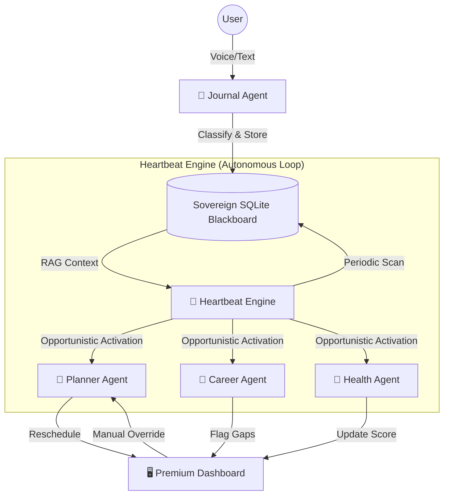

# Mirror: The Sovereign Personal Intelligence System
## Highly Detailed Technical Proposal

**Project Name**: Mirror  
**Runtime Engine**: Mirror v0.1.0  
**Base Architecture**: [mortava/mirror](https://github.com/theonlyhennygod/mirror)  
**Submission ID**: Samsung PRISM — Clash of the Claws  
**Principal Objective**: Elimination of the "Intention-Action Gap" via Autonomous Multi-Agent Orchestration.

---

## 1. Theme Selected
**Daily Utility (Smartphone/Desktop)**  
*Niche*: Autonomous life management for high-performance engineers and students.

---

## 2. Problem Statement: The Fragmentation of Human Intent
1. **The Intention-Action Gap**: Research shows a 50%+ failure rate in translating intentions into behavior. Current tools (Notion, Google Calendar) are "Dead Storage" — they store plans but do not act when those plans fail.
2. **Context Loss**: Information about why a goal failed (e.g., "I stayed up late coding") is lost because it's not linked to the schedule adjustment.
3. **Privacy Erosion**: Personal journals and productivity data are high-value targets for data harvesting. Users need a system where intelligence is "Leased" (Cloud API) but memory is "Owned" (Local SQLite).

---

## 3. Detailed Technical Architecture

### 3.1 The System Flow (Mermaid Diagram)


### 3.2 The Multi-Agent Reasoning Layer
Mirror utilizes 4 specialized agents, each operating with a restricted toolset and a curated system prompt to prevent "God-Agent" bloat and halluncination.

| Agent | Core Logic | Targeted Tools | Primary Memory Key |
| :--- | :--- | :--- | :--- |
| **Planner** | Dynamic Linear Programming for time blocks. | `file_read`, `memory_recall` | `current_plan_json` |
| **Journal** | Semantic classification of human reality. | `memory_store`, `speech_to_text` | `state_graph` |
| **Career** | Proof-of-Work gap analysis. | `google_search`, `memory_recall` | `career_gap_report` |
| **Health** | Longitudinal consistency auditing. | `memory_recall` | `consistency_score` |

### 3.3 Coordination Model: Deterministic Blackboard Pipeline (DLBP)
Mirror's core coordination contract is a deterministic blackboard architecture:
- **Blackboard**: the local SQLite database is the single shared state substrate.
- **Knowledge sources**: Journal/Planner/Career/Health operate as independent knowledge sources that read and write state, rather than messaging each other directly.
- **Asynchronous state convergence**: multiple agents can respond to the same state transition (for example: a missed task) without a central "supervisor" LLM.

This design reduces routing overhead, avoids a coordinator observability bottleneck, and supports heterogeneous small-model routing per agent.

### 3.4 Data Schemas (The "Mirror" Reality Format)
We utilize a unified JSON schema for state synchronization:

**Journal Entry Schema:**
```json
{
  "id": "entry_uuid_v4",
  "content": "Finished the Rust memory manager but skipped the gym.",
  "classification": "behavioral", 
  "impact": "missed_task", 
  "deviation": true,
  "metrics": { "completed": ["rust_mem_mgr"], "missed": ["gym_session"] },
  "timestamp": "2026-04-24T20:45:00Z"
}
```

### 3.5 Scheduling and Autonomous Wake-Up
Mirror's planner is designed to be proactive (not just reactive calendar shuffling):
- **Slack-aware scheduling**: prioritize by deadline + slack (zero-laxity style), not only by nearest deadline.
- **Autonomous wake-up**: the heartbeat can trigger nightly recomputation to pre-build the next day's schedule based on observed execution and constraints.
- **Implementation intentions**: schedule output favors "If-Then" triggers and environmental cues over purely time-blocked intentions.

### 3.6 Mixed-Motive Conflict Resolution (Career vs Health)
When long-term career objectives and short-term biological constraints disagree, Mirror avoids rigid overrides:
- **System objective**: optimize a single user-alignment objective subject to constraints.
- **Stabilization**: when readiness is mildly reduced, allow deep work with enforced breaks; when readiness is severely reduced, gate deep work and switch to recovery/maintenance tasks.

### 3.7 Governance and Containment (Circuit Breakers)
Proactive agency must be contained by deterministic controls:
- **Stateless policy interception** for every side-effecting tool call.
- **Rate limits** on calendar reshuffles and other high-frequency actions.
- **Blast-radius checks** to detect cascading schedule edits and require supervised approval.
- **Immutable audit trail**: persist an append-only log of blackboard reads/writes, conflict resolutions, and tool invocations.

---

## 4. User Journey: The "Autonomous Recovery" Loop

1. **Reality Capture**: At 2:00 PM, the user records a voice note: *"I'm stuck on a bug, I can't start the 3 PM study block."*
2. **Autonomous Analysis**: The **Journal Agent** classifies this as a `Critical` change.
3. **Proactive Recalibration**: The **Heartbeat Engine** detects the `Critical` flag. It wakes the **Planner Agent**.
4. **Schedule Healing**: The Planner reads the user's career goals (from memory) and notices that "System Design" is a priority. It shifts the study block to 7:00 PM and notifies the dashboard.
5. **Dashboard Reflection**: The user opens their phone and sees a refreshed timeline with a note: *"Mirror adjusted your day to prioritize System Design after your 2 PM delay."*

---

## 5. Implementation Stack & Dependencies

### 5.1 Backend: The Mirror Core (Rust)
- **Runtime**: Native Rust for zero-latency execution.
- **Web Layer**: `Axum` with Tower middleware for request body limiting (64KB) and timeouts (30s).
- **Communication**: Axum-based JSON API for frontend sync.
- **Memory**: `rusqlite` for local persistence + `Vector-RAG` for semantic recall.

### 5.2 Frontend: The Mirror Dashboard (React)
- **Framework**: Vite + React 18.
- **Animation**: `Framer Motion` for layout transitions (plan recalibration).
- **Icons**: `Lucide-React`.
- **Styling**: Vanilla CSS with a Custom Design System (Mirrored Surfaces, Glassmorphism).


---

## 6. Token Efficiency & Compute Budget
Mirror is designed to be "Token-Frugal," making it viable for both cloud and local models (Ollama).

- **System Prompt Compression**: Tool protocols are compressed by 35% using instruction-dense formatting.
- **Skill Injection**: Full skill context is injected directly into the prompt for targeted turns, saving 1 round-trip per message.
- **Estimated Cost**:
    - **Reactive Turn**: ~800 tokens (Input) / ~200 tokens (Output).
    - **Proactive Heartbeat**: ~400 tokens (Input) / ~100 tokens (Output).

---

## 7. Security & Privacy Protocol
- **Local-First**: No data is sent to the cloud for storage; only anonymized reasoning strings reach the LLM provider.
- **Pairing Protocol**: 256-bit secure pairing for the dashboard-backend connection.
- **Idempotency**: Webhook and memory writes are protected by UUID-based idempotency to prevent duplicate logs.

### 7.1 The Governance-Containment Gap (Agentic Security)
Mirror explicitly treats proactive tool-use as a new threat surface:
- **No implicit permission broadening**: unsupported actions fail fast rather than falling back to permissive behavior.
- **HITL checkpoints**: destructive, external, or high-impact actions require user approval via the dashboard.
- **Auditability**: logs must avoid secrets while remaining sufficient for incident triage and rollback.

---

## 8. Planned Development Timeline (Gantt Chart Representation)
- **Phase 1 (April 20-24)**: Core Runtime Engineering (Backend, Gateway, Memory). (Status: **Done**)
- **Phase 2 (April 25-28)**: Multi-Agent Intelligence & Optimization (Skills, Injection). (Status: **Done**)
- **Phase 3 (April 29-May 3)**: Visual Analytics & Dashboard implementation.
- **Phase 4 (May 4-May 6)**: Autonomous Heartbeat Engine & Stress-Testing.
- **Phase 5 (May 7-May 8)**: Submission Finalization & Demo production.

---
**Mirror is the next evolution of personal computing — where the system doesn't just store your life, it reflects your highest intentions back to you.**
